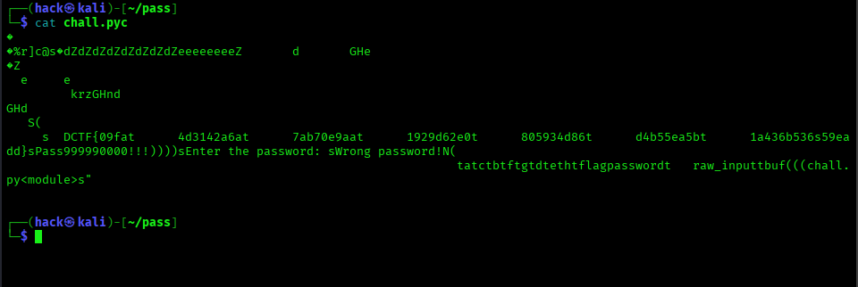
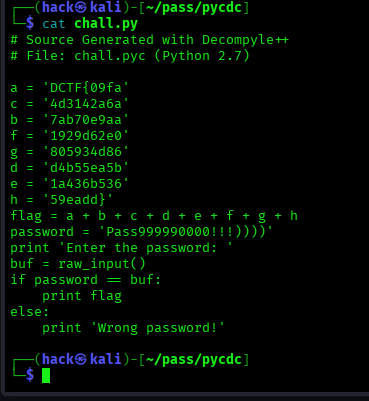

# password - CyberEDU | MISC | Entry-Level | Writeup
----
**DESCRIEREA EXERCITIULUI:**

Puteţi găsi parola? Cer un prieten.

Format steag: DCTF{sha256}

**Intelegerea cerintei:**

Enuntul ne spune **Puteti gasi parola**, trebuie sa cautam parola

**Cerintele Problemei:**

Format steag: DCTF{sha256}  

### Rezolvare:

1. prima data sa descarcam acel fisier "chall.pyc"

2. Analizam fisierul cu urmatoarele comenzi:

                     file chall.pyc
                     exiftool chall.pyc
    
   Observam ca ne afiseaza: 
           
 <p align="center"></p>


 Si putem vedea ca la exiftool ne spune ca e un fisier necunoscut, dar si **compilat**, ar trebui sa o **decompilam**.

 Daca introducem comanda:

                      cat chall.pyc

  Putem observa caractere si cateva scrieri zgomotoase, chiar si la acel flag afisand nu e ceea corecta.

 <p align="center"></p>

3. Dupa ce am putut analiza si observa, ar trebui sa **decompilam** acest fisier, cu ajutorul unor comenzi care ar trebui instalate si usor de folosit.

4. Aceea comanda se poate numi "uncompyle6". 

----
# INSTRUCTIUNI Instalari comenzi:

## Kali Linux:

1. facem un update si un upgrade al sistemului nostru:

                            sudo apt update && sudo apt upgrade

2. instalari comenzi:

                            pipx install uncompyle6 
                                   sau 
                            pip install uncompyle6

## Termux:

1. facem un update si un upgrade al aplicati termux:

                           pkg update && pkg upgrade

2. Instalam unelte de compilare:

                           pkg install clang cmake make git

3. Descarca codul sursa si compileaza-l:

                           git clone https://github.com/zrax/pycdc.git
                           cd pycdc
                           cmake .
                           make

4. Rulam sa putem decompila fisierul si sa-l salvam intr-un fisier nou numit **chall.py** cu aceasta comanda:

                          ./pycdc ../chall.pyc > chall.py


5. Dupa ce sa salvat, trebuie sa ne uitam putin la cod sa vedem daca ne arata parola folosind comanda:

                          cat chall.py 

  Si vedem in cod ca ne afiseaza parola:

 <p align="center"></p>


 iar apoi introducem comanda cu parola gasita:

                          python2 chall.py
  
  Introducem parola gasita, adica: Pass999990000!!!))))))

---

### Dupa ce am terminat cei care sunt utilizatori pentru TERMUX, trebuie sa facem si la noi in sistem:

   **DE ASEMENEA, PUTEM INSTALA SI CONFIGURA ASA CUM AM ARATAT PENTRU TERMUX!!!!**

5. Dupa ce am reusit sa instalam **uncompyle6**, rulam aceasta comanda:

                             uncompyle6 chall.pyc > chall.py

   O sa ne salveze in chall.py tot output-ul al decompilari **uncompyle6 chall.pyc**

6. Acum sa rulam cu python2, ne uitam in codul sursa al **chall.py**, stergem spre final care este scris **return**, si acum sa rulam:

   De ce ar trebui sters acel **return**?, din cauza ca, atunci cand am decopilat cu **uncompyle6**, tind sa mai adauge un **return** la finalul 
   fisierului pentru ca, in bytecode-ul Python, orice modul se termina tehnic cu o intructiune de return (de obicei return None).

                               python2 chall.py

  Introducem parola noastra, si BINGO ne afiseaza flag-ul

---
### FLAG gasit:

DCTF{09fa7ab70e9aa4d3142a6ad4b55ea5b1a436b5361929d620805934d8659eadd}
---

FELICITARI!!!


# DE CE E MAI BUN pycdc decat uncompyle6?
```text
1. Modul de funcționare (Arhitectura):

a) uncompyle6 (Native Python): Este scris în Python. El încearcă să transforme bytecode-ul 
   înapoi în cod sursă folosind un sistem de „gramatică”.Practic, el parsează instrucțiunile 
   și încearcă să potrivească tipare (patterns) pentru a reconstrui structuri precum if, while 
   sau try-except.

b) pycdc (C++ Deserializer): Este scris în C++. Acesta nu se bazează pe librăriile interne 
   ale Python, ci analizează direct structura binară a fișierului.Este un „disassembler” și 
   „decompiler” de sine stătător, mult mai rapid și mai puțin dependent de mediul în care rulează.
                
2. De ce pycdc este, de obicei, „mai bun”?

   În contextul securității cibernetice și al CTF-urilor, pycdc câștigă din următoarele motive:

a) Imunitatea la versiunea gazdă: Dacă rulezi Python 3.12 în Termux și încerci să instalezi 
   uncompyle6, acesta va eșua deoarece uncompyle6 însuși nu știe să ruleze pe un interpretor atât 
   de nou. pycdc, fiind un binar compilat, nu are această problemă.

b) Suport pentru Magic Numbers: Fiecare versiune de Python are un „Magic Number” specific la 
   începutul fișierului .pyc. uncompyle6 se oprește dacă nu recunoaște numărul, 
   în timp ce pycdc are o tabelă internă actualizată constant pentru aproape orice versiune.
            
3. Când este uncompyle6 mai bun?

   Există un singur scenariu unde uncompyle6 este superior: codul foarte vechi (Python 2.7 - 3.6) 
   care conține structuri de control complexe. Deoarece uncompyle6 este scris în Python, 
   „înțelege” uneori mai bine subtilitățile limbajului pentru versiunile 
   pe care le suportă oficial, generând un cod sursă mai curat și mai ușor de citit decât pycdc.
```

