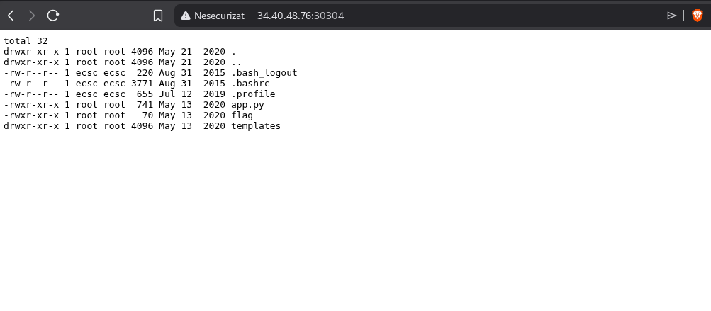

# ping-station - CyberEDU | Web | Easy | Writeup
---

**DESCRIERE EXERCITIULUI:**

Doar un alt serviciu de ping de auditat

## INTELEGEREA EXERCITIULUI:

Ne spune ca e un alt serviciu de audit.

**Cerintele Problemei:**

Q1. Ce este steagul?

### REZOLVARE:

1. Primul pas e sa pornim serverul, si in momentul de fata sa activat si avem acest sever activat: "34.40.48.76:30304".
   Si observam ca avem si un fisier cu cod in limbaj python, il vom descarca si analizam.

2. Dupa ce am descarcat fisierul, e sa analizam putin ce face acel cod, mai jos las explicatie fiecare linie de comanda
   ce face fiecare aparte.

```python
from flask import Flask, render_template, url_for, request, redirect # Importă framework-ul web Flask și utilitarele necesare

import subprocess # Importă modulul pentru a rula comenzi de sistem (ex: ping, ls)
import re         # Importă modulul pentru expresii regulate (Regex)
import string     # Importă utilitare pentru lucrul cu șiruri de caractere

app = Flask(__name__) # Inițializează aplicația Flask

 # Funcție care verifică dacă input-ul utilizatorului seamănă cu o adresă IP
def is_valid_ip(ip):
    # ATENȚIE: Acest Regex este vulnerabil! 
    # (\S{1,9}) permite orice caracter care NU este spațiu (inclusiv ; & |)
    ipv = re.match(r"^(\d{1,3})\.(\d{1,3})\.(\S{1,9})|(/s)\.(\d{1,3})$",ip)
    return bool(ipv) # Returnează True dacă se potrivește, False în caz contrar

 # Definește ruta principală pentru pagină, acceptând metodele GET și POST
@app.route('/', methods=['POST', 'GET'])
def index():
    # Verifică dacă utilizatorul a trimis formularul (a dat click pe buton)
    if request.method == 'POST':
        ip = request.form['content'] # Extrage textul introdus de utilizator în input-ul 'content'
        
        # Apelează funcția de validare definită mai sus
        if (is_valid_ip(ip)==True):
            # O buclă for care rulează teoretic de 2 ori, dar se oprește la prima execuție
            for i in range(0,2):
                # EXECUTĂ COMANDA: Aici are loc Command Injection.
                # subprocess.check_output rulează comanda în shell-ul sistemului.
                # "ping -c 4 " + ip concatenează comanda cu input-ul tău neverificat corect.
                return '<pre>'+subprocess.check_output("ping -c 4 "+ip,shell=True).decode()+'</pre>'
                break # Întrerupe bucla imediat după primul return
        else:
            # Mesaj de eroare dacă regex-ul nu a fost validat
            return "That's not a valid IP"
    else:
        # Dacă accesăm pagina prin GET (vizitare normală), afișează interfața HTML
        # Notă: Necesită existența folderului 'templates' și a fișierului 'index.html'
        return render_template('index.html')

 # Pornește serverul pe adresa 0.0.0.0 (accesibil din toată rețeaua)
if __name__ == "__main__":
    app.run(host = "0.0.0.0")
```

3. Explicație pe scurt a fluxului:

           Input: Aplicația așteaptă un text de la tine prin formular.

           Filtru: Verifică dacă textul începe cu ceva de genul cifre.cifre. folosind is_valid_ip. 
                   Din cauza erorii din regex (\S{1,9}), poți pune ;ls imediat după IP.

           Execuție: Programul "lipește" textul tău la comanda de ping. Dacă scrii 127.0.0.1;whoami, serverul execută: 
                     ping -c 4 127.0.0.1;whoami.

           Afișare: Rezultatul comenzii (atât ping-ul, cât și rezultatul injectat) 
                    este trimis înapoi în browserul tău între tag-uri <pre>.

4. Dupa ce am explicat si lamurit treburile, sa accesam serverul challenge-ului si sa vedem ce ne afiseaza pe site.
   Observa, ca putem sa inseram un IP, am decis sa inserez:

                   127.0.0.1;ls -la 
    
   Si ne va afisa asa cum arata in imaginea de jos:

<p align="center"></p>

5. Opaa, observa ca am reusit sa injectam si sa obtinem ceeea ce dorim, acum ca observam ca avem **flag** acolo, e sa introducem aceasta comanda:

         127.0.0.1;cat flag

  Si observam ca ne afiseaza flag-ul, si acela ar fi:

---
# FLAG:
---
ECSC{b1c0bc8e5e1b4c81199ad3c41bef8b69bea3ab86ecfb08c211d90ace0ff98d3}

### SUCCES MAI DEPARTE :)))


