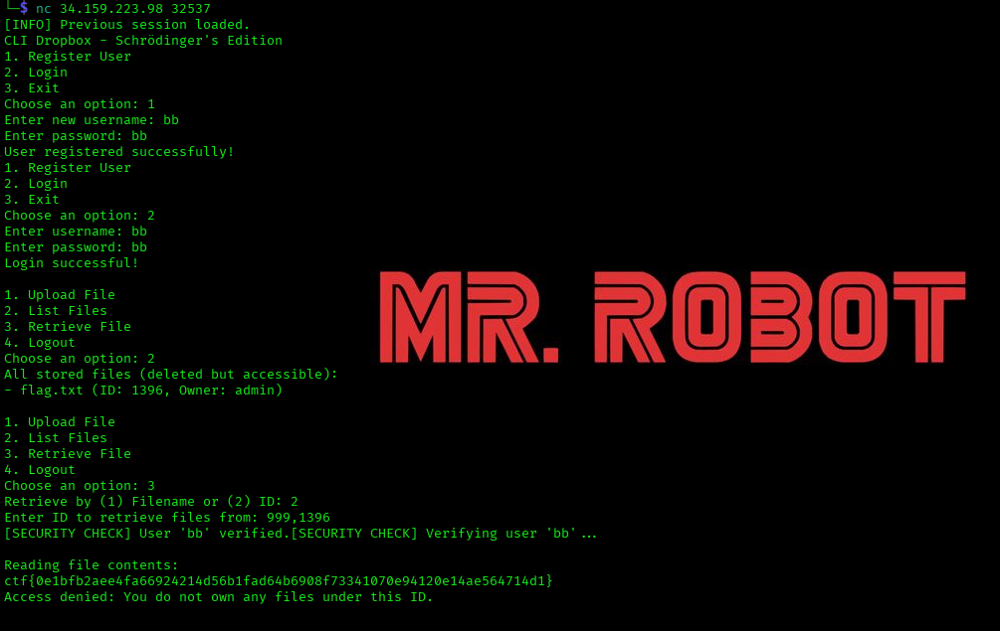

# SchrodingerFiles - UNbreakable | Misc | Hard | Writeup
---

**DESCRIEREA CERINTEI:**

Ceva ciudat se întâmplă cu noul sistem de fişiere. 
Se pare că stochează fișiere într-un mod ciudat, trebuie să găsesc o modalitate de a citi fișierele administratorului.

## INTELEGEREA CERINTEI:

Ca ceva ciudat ni se intampla cu noul sistem de fisier. Se pare ca stocheaza niste fisiere
intr-un mod ciudat, si ar trebui sa gasim o modalitate de a citi fisierele *administratorului*.

## REZOLVARE:

1. Prima data sa descarcam acel fisier *challenge.py* si apoi sa pornim acel server, serverul
   meu este "34.159.223.98:32537", dupa ce avem fisierul descarcat si acel server pornit, e 
   sa analizam prima data codul sursa, folosim comanda:

                             cat challenge.py

   Si observam acest cod lung, dar si explicat sa va pot explica ce face fiecare linie de cod:

```python
# =========================
# IMPORTURI
# =========================

import os
# os → interacțiune cu sistemul de operare:
# - fișiere / directoare
# - PID-ul procesului (os.getpid())
# - ștergere fișiere (os.unlink)
# - folosit indirect pentru /proc/<pid>/fd/

import time
# time → folosit pentru:
# - verificarea expirării sesiunii
# - compararea timestamp-urilor

import hashlib
# hashlib → hashing parole (SHA256)
# parolele NU sunt stocate în clar

import random
import string
# random + string → generare parolă random pentru admin

import threading
# threading → rulare concurentă
# introduce race condition (intenționat, CTF)

import json
# json → salvarea / încărcarea sesiunii pe disk

import sys
# sys → setări interne Python

from secret import flag
# flag → flag-ul CTF (secret)

# Dezactivează limita Python pentru conversii foarte mari int → string
# (util pentru input-uri malițioase / exploit)
sys.set_int_max_str_digits(9999999)


# =========================
# CONSTANTE GLOBALE
# =========================

UPLOAD_DIR = "/tmp/cli_dropbox/"
# Directorul unde sunt create temporar fișierele

SESSION_FILE = "/tmp/cli_dropbox/session.json"
# Fișierul unde se salvează sesiunea

FILES = {}
# FILES[filename] = (file_object, pid, owner)
# file_object → descriptor deschis
# pid → PID-ul procesului
# owner → cine deține fișierul

FILES_BY_ID = {}
# FILES_BY_ID[pid] = { filename: file_object }
# indexare fișiere după PID

USERS = {}
# USERS[username] = hash(parola)

SESSION_DURATION = 600
# sesiunea expiră după 600 secunde (10 minute)


# =========================
# SALVARE SESIUNE
# =========================

def save_session():
    # Construiește structura de date ce va fi salvată pe disk
    session_data = {
        # Salvăm doar PID-ul și owner-ul
        # file_object NU poate fi serializat
        "FILES": {
            k: (v[1], v[2])
            for k, v in FILES.items()
            if k != "flag.txt"  # flag-ul nu se salvează
        },

        # Salvăm doar numele fișierelor asociate fiecărui PID
        # NU salvăm file descriptorii
        "FILES_BY_ID": {
            str(k): list(v.keys())
            for k, v in FILES_BY_ID.items()
            if k != os.getpid()
        },

        # Salvăm utilizatorii (username → hash)
        "USERS": USERS
    }

    # Scriem sesiunea pe disk
    with open(SESSION_FILE, "w") as f:
        json.dump(session_data, f)
    # Persistență între rulări


# =========================
# ÎNCĂRCARE SESIUNE
# =========================

def load_session():
    global FILES, FILES_BY_ID, USERS

    if os.path.exists(SESSION_FILE):

        # Dacă sesiunea e prea veche, o ștergem
        if time.time() - os.path.getmtime(SESSION_FILE) > SESSION_DURATION:
            os.remove(SESSION_FILE)

        else:
            # Citim sesiunea
            with open(SESSION_FILE, "r") as f:
                session_data = json.load(f)

                # Reconstruim FILES
                # file_object este None → stare INCONSISTENTĂ
                FILES = {
                    k: (None, v[0], v[1])
                    for k, v in session_data["FILES"].items()
                }

                # Reconstruim FILES_BY_ID
                # descriptorii NU mai există
                FILES_BY_ID = {
                    int(k): {fname: None for fname in v}
                    for k, v in session_data["FILES_BY_ID"].items()
                }

                # Încărcăm utilizatorii
                USERS = session_data["USERS"]

                print("[INFO] Previous session loaded.")


# Încărcăm sesiunea la pornire
load_session()


# =========================
# ADMIN AUTO-CREAT
# =========================

def generate_random_password(length=12):
    # Generează o parolă random pentru admin
    characters = string.ascii_letters + string.digits + string.punctuation
    return ''.join(random.choice(characters) for _ in range(length))


# Dacă admin nu există, îl creăm automat
if "admin" not in USERS:
    admin_password = generate_random_password()

    # Salvăm DOAR hash-ul
    # Parola NU este afișată → admin nu se poate loga normal
    USERS["admin"] = hashlib.sha256(admin_password.encode()).hexdigest()


# =========================
# ASIGURĂ DIRECTORUL
# =========================

def ensure_dir():
    if not os.path.exists(UPLOAD_DIR):
        os.makedirs(UPLOAD_DIR)

ensure_dir()


# =========================
# FLAG (FOARTE IMPORTANT)
# =========================

FLAG = flag
flag_file_path = os.path.join(UPLOAD_DIR, "flag.txt")

# Creăm fișierul flag
admin_file = open(flag_file_path, "w+")

# Scriem flag-ul
admin_file.write(FLAG)
admin_file.flush()

# Ștergem fișierul din filesystem
# DAR descriptorul rămâne deschis în memorie
os.unlink(flag_file_path)

# Înregistrăm flag-ul ca fișier admin
FILES["flag.txt"] = (admin_file, os.getpid(), "admin")

# Asociem flag-ul cu PID-ul procesului
FILES_BY_ID[str(os.getpid())] = {"flag.txt": admin_file}


# =========================
# MANAGEMENT UTILIZATORI
# =========================

def hash_password(password):
    # Returnează hash-ul SHA256 al parolei
    return hashlib.sha256(password.encode()).hexdigest()


def register_user():
    username = input("Enter new username: ")

    if username in USERS:
        print("Username already exists.")
        return

    password = input("Enter password: ")

    # Salvăm hash-ul parolei
    USERS[username] = hash_password(password)

    print("User registered successfully!")
    save_session()


def login_user():
    username = input("Enter username: ")

    if username not in USERS:
        print("User not found.")
        return None

    password = input("Enter password: ")

    # Comparăm hash-uri
    if USERS[username] == hash_password(password):
        print("Login successful!")
        return username
    else:
        print("Incorrect password.")
        return None


# =========================
# UPLOAD FIȘIER (ADMIN)
# =========================

def save_file(user):
    if user == "admin":

        filename = input("Enter filename to upload: ")
        file_path = os.path.join(UPLOAD_DIR, filename)
        content = input("Enter file content: ")

        # Creăm fișierul
        f = open(file_path, "w+")
        f.write(content)
        f.flush()

        _id = os.getpid()

        # Salvăm în structuri
        FILES[filename] = (f, _id, user)

        if _id not in FILES_BY_ID:
            FILES_BY_ID[_id] = {}

        FILES_BY_ID[_id][filename] = f

        # Ștergem fișierul din filesystem
        os.unlink(file_path)

        print(f"File '{filename}' uploaded and is now 'invisible'. ID: {_id}")
        save_session()

    else:
        print("Only premium users can upload files")


# =========================
# LISTARE FIȘIERE
# =========================

def list_files(user):
    # NU există verificare de permisiuni
    print("All stored files (deleted but accessible):")

    for fname, (_, _id, owner) in FILES.items():
        print(f"- {fname} (ID: {_id}, Owner: {owner})")


# =========================
# VERIFICARE ACCES (THREAD)
# =========================

def read_file(user, _id):
    global premium

    _id = str(int(_id))

    if str(_id) in FILES_BY_ID:
        print(f"[SECURITY CHECK] Verifying user '{user}'...")

        # Dacă user-ul deține vreun fișier sub acest PID
        if any(
            owner == user
            for owner in (FILES[filename][2] for filename in FILES_BY_ID[str(_id)])
        ):
            premium = 1
        else:
            premium = 0
    else:
        print("No files found for that ID.")

    print("PREMIUM:", premium)


# Flag global → RACE CONDITION
premium = 1


# =========================
# RECUPERARE FIȘIER
# =========================

def retrieve_file(user):
    global premium

    option = input("Retrieve by (1) Filename or (2) ID: ")

    if option == "1":
        filename = input("Enter filename to retrieve: ")

        if filename in FILES and FILES[filename][2] == user:
            print("Your file is indexed by ID.")
        else:
            print("Access denied.")

    elif option == "2":
        _id = input("Enter ID to retrieve files from: ")

        # Permite mai multe PID-uri
        _id = _id.split(",")[:3]

        for __id in _id:
            # Lansăm thread-ul de verificare
            thread = threading.Thread(
                target=read_file,
                args=(user, __id)
            )
            thread.start()

            # Verificare făcută FĂRĂ join() → race condition
            if premium == 1:
                print("[SECURITY CHECK] User verified.")
                print("Reading file contents:")

                if __id in FILES_BY_ID:
                    for fname in FILES_BY_ID[__id]:

                        # Acces direct la file descriptor
                        with open(f"/proc/{__id}/fd/6", "r") as file:
                            # BUG LOGIC: condiția e inversată
                            if premium == 0:
                                print(file.read())
            else:
                print("Access denied.")

    else:
        print("Invalid option.")


# =========================
# MAIN LOOP
# =========================

def main():
    print("CLI Dropbox - Schrödinger's Edition")

    while True:
        print("1. Register User")
        print("2. Login")
        print("3. Exit")

        choice = input("Choose an option: ")

        if choice == "1":
            register_user()

        elif choice == "2":
            user = login_user()

            if user:
                while True:
                    print("\n1. Upload File")
                    print("2. List Files")
                    print("3. Retrieve File")
                    print("4. Logout")

                    sub_choice = input("Choose an option: ")

                    if sub_choice == "1":
                        save_file(user)
                    elif sub_choice == "2":
                        list_files(user)
                    elif sub_choice == "3":
                        retrieve_file(user)
                    elif sub_choice == "4":
                        print("Logging out...")
                        break

        elif choice == "3":
            print("Goodbye!")
            break


# Pornire program
if __name__ == "__main__":
    main()

```


2. Pasul doi, dupa ce am verificat codul si explicat ce face fiecare linie de cod, acum e sa rulam serverul si sa incepem de a ne loga prima data,
   trebuie sa introducem numele nostru si o parola, apoi sa ne conectam si sa introducem PID-ul.

   sa ne putem conecta la server introducem aceasta linie de cod:

                                                        nc 34.159.223.98 32537

   Si observam ca ne afiseaza asta:

                                               CLI Dropbox - Schrödinger's Edition
                                                  1. Register User
                                                  2. Login
                                                  3. Exit
                                               Choose an option:

3. Dupa cum putem vedea e sa alegem optiunile de acolo, alegem numarul 1, la username: aa, si password: aa, dupa ne-am inregistrat.
   Dupa ce ne-am inregistrat, putem sa ne conectam la numele nostru creat, adica aa, si parola tot cu aa.
   Apoi ce am facut toate treburile acestea, observam ca ne afiseaza asta:

                                                  1. Register User
                                                  2. Login
                                                  3. Exit
                                                  Choose an option: 2
                                                  Enter username: aa 
                                                  Enter password: aa
                                                  Login successful!

                                                  1. Upload File
                                                  2. List Files
                                                  3. Retrieve File
                                                  4. Logout

4. Ce vedem ca am reusit sa ne logam, ca ne afiseaza acel mesaj "Login successful", vedem ca avem acele 4 optiuni, alegem optiunea List Files adica pe 2, 
   vedem ca ne afiseaza un PID al fisierului flag.txt, pid-ul ar fi orice numar generat, ex 48, 1307, 1170, etc...

5. Dupa aceea alegem optiunea 3.Retrieve File, si apoi optiunea 2, adica PID, si acolo introducem pid-ul nostru, dar nu primul pid al fisierului
   ca apoi nu ne va afisa flag-ul, introducem un pid random de la 1-999, si apoi puneti o virgula si langa virgula PID-ul nostru al fisierului


   Si bingooo, flag-ul a aparut

### BONUS
------
Mai jos aveti imaginea cum am exploatat acel server, pas cu pas:

<p align="center"></p>

----

---
### SCRIPT PENTRU EXPLOATARE
 
Il gasiti in profil la mine, la SchrodingerFiles.py
---

De ce am introdus prima data un pid aleatorie si nu pe cel al nostru?

**Ce se întâmplă:**
1. Se creează thread pentru PID `999` (inexistent)
2. Se creează thread pentru PID `48` (admin)
3. Thread-ul pentru `999` execută și printează valoarea curentă a lui `premium` (care este 1)
4. În acest moment, bucla principală verifică `if premium == 1:` și intră în bloc
5. Thread-ul pentru `48` execută și setează `premium = 0` (pentru că nu suntem proprietari)
6. Când ajunge la `if premium == 0:` în interiorul blocului `with open()`, condiția este adevărată
7. Se citește conținutul din `/proc/48/fd/6`


## Concluzie

Challenge-ul demonstrează pericolul race condition-urilor în aplicațiile multi-threaded și importanța gestionării corecte a stării partajate între thread-uri. Vulnerabilitatea a fost exploatată prin manipularea timing-ului executării thread-urilor pentru a ocoli mecanismul de verificare a permisiunilor.
