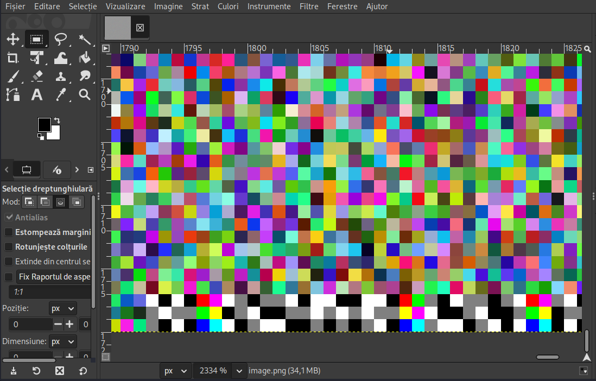
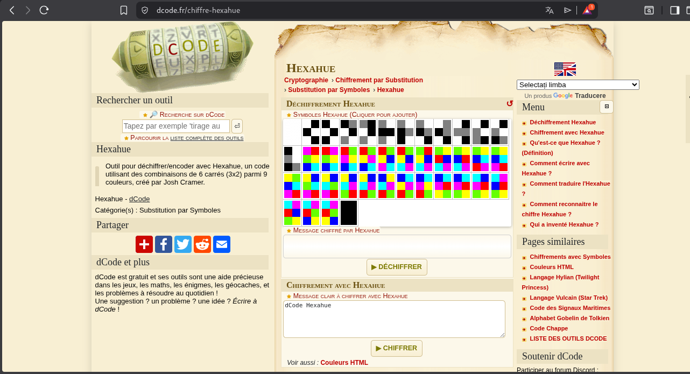
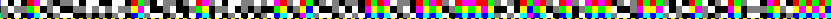

# rgb - UNbreakable | Steganography | Medium | Writeup

**DESCRIEREA CERINTEI:**

Hue a adunat pixelii acestei imagini și a ascuns ceva în ea.

Formatul steagului: sha256.

Confirmarea steagului CTF{sha256}.

### REZOLVARE:

Salut, astazi vom rezolva RGB, enuntul ne spune in felul urmator:

Hue a adunat acesti pixeli intr-o imagine ascuna in ea

Rezolvare:

1. Observam ca avem un folder cu extensia .zip, descarcam si observam ca avem o imagine dupa
   ce am inserat aceasta comanda:

                                  unzip imagine.zip

2. Vedem ca avem o imagine image.png, sa putem vizualiza folosim aceasta comanda:

                                   xdg-open image.png

   si observam ca avem o imagine pixelata si urata, nu intelegi aproape nimic de acolo, darrr ceva se poate ascunde,
   si e mai colorat, mai evidentiat culorile decat celelalte care sunt mai zgomotoase.
   Locul acela se afla fix in partea **DREAPTA JOS**.

3. Sa putem decoda ce se poate afla acei pixeli **hexahue**, la partea **DREAPTA JOS**, facem in felul urmator:
   deschidem imaginea cu **GIMP**, cu aceasta comanda:

                                     gimp imagine.png

4. Observam ca se deschidea editorul de imagini, sa putem aveea aceea imagine mai clara si mai concreta sa putem vedea acele culori, 
   procedam in felul urmator:

   a) Sa marim imaginea sa fie ditamai dimensiunea mare, cu 2334% dimensiunea imagini, ar trebui sa arate cam asa:

 

Sa ajungeti acolo la acei pixeli e sa va ducweti mult **DREAPTA** si mult **JOS**
                                    

5. Dupa ce avem acei pixeli in vizorul nostru, putem sa decodam in hexahue, poate va intrebati cum?
   Foarte simplu, incepand de la gri si alb, tinand cont ca se ia cu tot 2 blocuri de la stanga la dreapta, si acele 2 blocuri cu 6 total, 
   cum e si in imaginea de jos:

Cum ati vazut in imagine asa este in 6 total cate un patrat, 2*3 = 6

6. Sa putem trece la treaba, accesam dcode.fr, si cautam hexahue, si ne afiseaza cum e in imagine:

7. Acum ca avem de toate la indemana, incepem sa cautam fiecare pixel cum e in gimp si sa cautam cum e acolo culorile, si la final ne afiseaza flag final

Bingo, ai reusit!!!

-----
### Bonus
-----

Asta e tot hexahue pe care trebuie sa decifrezi:

