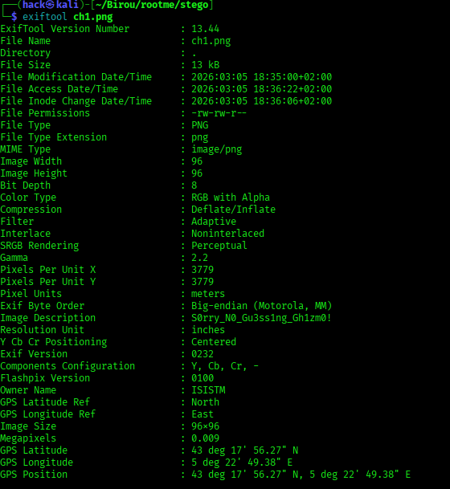
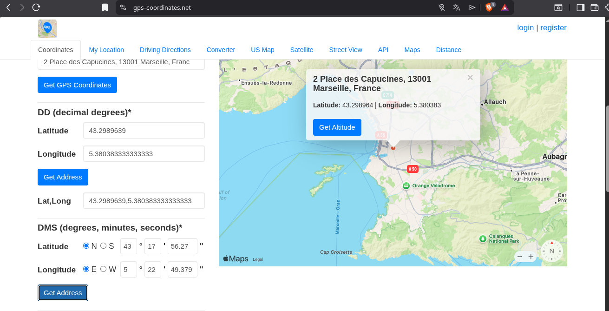

# EXIF - Metadata - ROOT-ME | Very-Easy | Writeup

**Descrierea Cerintei:**

Tristul nostru prieten pepo s-a rătăcit! Poți găsi unde este el?

Parola este orașul în care se află pepo.

## Intelegerea problemei:

Problema ne spune ca sa ratacit, si trebuie sa gasim locatia lui.

Locatia lui ar insemna flag-ul.

### Rezolvare:

1. prima data e sa descarcam aceea imagine care se poate numi:

              ch1.png

2. Analizam aceea imagine cu comanda:

            exiftool ch1.png

  si observam ca ne afiseaza asa cum se vede si in imaginea de mai jos: 

  

3. Vedem ca avem niste informati despre GPS cu logitudine si latitudine, totodata si cu pozitie.

4. cautand pe site la acest link:

           https://www.gps-coordinates.net/

5. Tot ce trebuie sa facem e sa introducem informatiile gasite acolo pe site, cu latitudine si logitudine, cum se poate vedea in imaginea de jos:

    

6. Observam ca sa gasit locatia, in Franta fiind orasul gasit:

           Marseille

7. Felicitari, ai putut rezolva acest challenge

Flag gasit sau Parola gasita este: Marseille 

:)))
 
